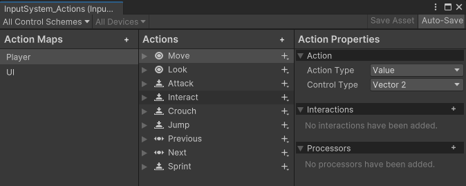

!!! warning ""

    译注：本文中的图片尚未汉化。

# 输入系统（Input System）

输入系统能够让用户使用设备、触摸屏或手势来控制您的游戏或应用程序。

## 简介

*输入动作编辑器（Input Actions Editor）窗口，展示了输入系统拓展包（Input System package）中预配置的一些默认动作。*

Unity 通过两个独立的系统来支持输入：一个系统较旧，而另一个较新。

较旧的系统是编辑器内置的，称为 [输入管理器（Input Manager）:octicons-link-external-16:](https://docs.unity3d.com/Manual/class-InputManager.html)。输入管理器是 Unity 核心平台的一部分，如果您没有安装本文所述的输入系统拓展包，那么它就是默认的输入系统。

本文所述的**输入系统拓展包**是一个更现代、更灵活的系统，能够让您使用任何类型的输入设备来控制您的 Unity 内容。它旨在替代 Unity 经典的输入管理器。它被简称为“输入系统包”或**“输入系统”**。要使用它，您必须[使用包管理器（Package Manager）将其安装到您的项目中](installation.zh.md)。

在安装输入系统拓展包的过程中，安装程序会提示是否自动停用较旧的内置系统。([了解更多](installation.zh.md))

若要开始使用，请参阅[安装（Installation）](installation.zh.md) 和[工作流（Workflows）](https://docs.unity3d.com/Packages/com.unity.inputsystem@1.19/manual/Workflows.html) 章节。相关示例项目，请查看 GitHub 上的 [战士 demo（Warriors demo）:octicons-link-external-16:](https://github.com/UnityTechnologies/InputSystem_Warriors)。
