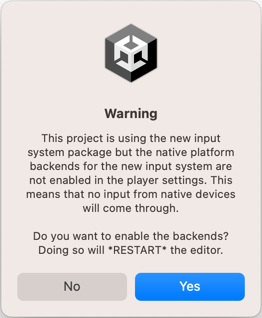
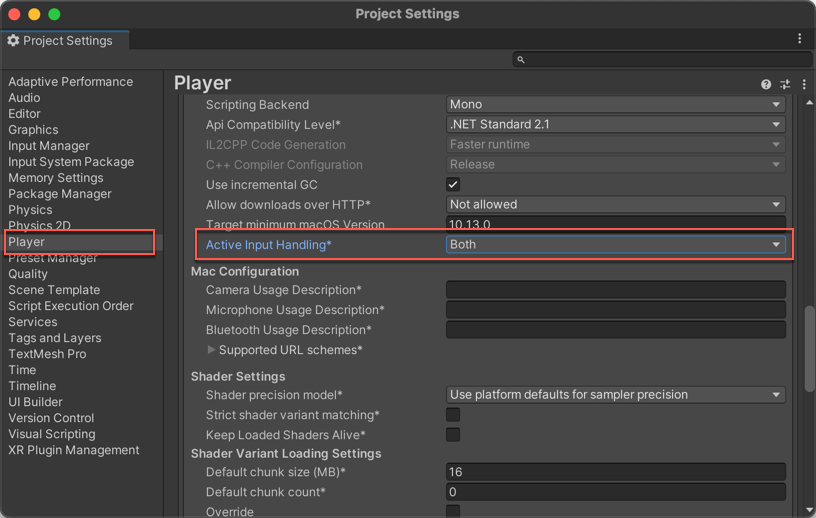
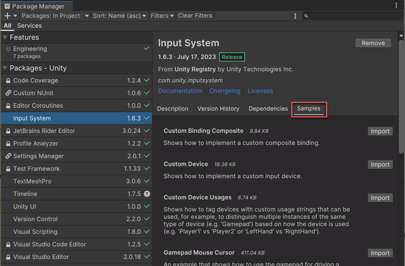

!!! warning "本文仍在施工。"

!!! warning "译注：本文中的图片尚未汉化。如无特殊说明，下文中的高亮块均为原注。"

# 安装指南

本页介绍了如何为您的 Unity 项目安装并启用输入系统扩展包（Input System package）。

!!! note "提示"

    此版本的输入系统需要 .NET 4 运行时。它无法在运行旧版 .NET 3.5 运行时的项目中使用。
    
    此扩展包仅兼容 2021.3 及更高版本的 Unity 编辑器 。如果您使用的编辑器版本低于 2021.3，则需要改用与编辑器版本兼容的扩展包版本，具体请参考 [Unity 包管理器 (Unity Package Manager) :octicons-link-external-16:](https://docs.unity3d.com/Manual/upm-ui.html) 窗口中带有 **Release** 标签的版本。

## 安装扩展包

若要安装新的输入系统：

1. 在 Unity 编辑器的主菜单中，前往 **窗口（Windows）** > **包管理器（Package Manager）** 以打开 Unity 包管理器。[^1]

2. 从导航面板中选择 **Unity Registry**。

3. Select the Input System package from the list.

    The Package Manager automatically selects that version to install by default.

4. Select Install, follow any prompts to enable the backends for the new Input System.

This package also provides several samples that demonstrate how to work with the new Input System, which are also available on the [Unity Package Manager :octicons-link-external-16:](https://docs.unity3d.com/Manual/upm-ui.html) window. Refer to [Install samples](https://docs.unity3d.com/Packages/com.unity.inputsystem@1.19/manual/Installation.html#install-samples).

## Enable the new input backends

By default, Unity's classic Input Manager (`UnityEngine.Input`) is active, and support for the new Input System is inactive. This allows existing Unity Projects to keep working as they are.

When you install the Input System package, Unity will ask whether you want to enable the new backends. Click Yes to enable the new backends and disable the old backends. The Editor restarts during this process.

You can find the corresponding setting in **Edit** > **Project Settings** > **Player** > **Other Settings** > **Active Input Handling**. If you change this setting you must restart the Editor for it to take effect.

!!! note "提示"

    You can enable both the old and the new system at the same time. To do so, set **Active Input Handling** to **Both**.

When the new input backends are enabled, the `ENABLE_INPUT_SYSTEM=1` C# `#define` is added to builds. Similarly, when the old input backends are enabled, the `ENABLE_LEGACY_INPUT_MANAGER=`1 C# `#define` is added. Because both can be enabled at the same time, it is possible for **both** defines to be 1 at the same time.

## Install samples

The Input System package comes with a number of samples. You can install these directly from the Package Manager window in Unity (**Window > Package Manager**). To see the list of samples, select the Input System package in the Package Manager window and click the **Samples** tab. Then click **Import** next to any sample name to import it into the current Project.

For a more comprehensive demo project for the Input System, see the [InputSystem_Warriors :octicons-link-external-16:](https://github.com/UnityTechnologies/InputSystem_Warriors) GitHub repository.

[^1]: 译注：在某些版本的 Unity 编辑器中，这个菜单可能位于 **窗口（Windows）** > **Package Management** > **包管理器（Package Manager）**。
