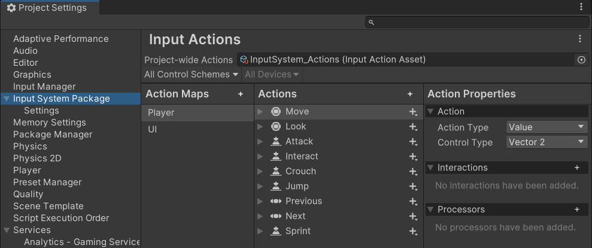

!!! info ""

    译注：本文中的图片未进行汉化。

# 快速入门指南

本页简要介绍了如何快速开始使用输入系统（Input System）。输入系统提供了[多种工作流 :octicons-link-external-16:](https://docs.unity3d.com/Packages/com.unity.inputsystem@1.19/manual/Workflows.html)，您可以根据它们各自的优势来选择。本快速入门指南将展示适合大多数常见场景的工作流。

首先，安装输入系统扩展包。有关如何安装新输入系统的信息，请参阅[安装指南](./installation.zh.md)。

## 创建并分配默认的全项目级动作

输入系统将您的输入配置存储在 **动作资产（Actions Asset）** 中。首次安装输入系统扩展包时，您必须创建此动作资产。

您可以通过依次点击主菜单的 **编辑（Edit）** > **项目设置（Project Settings）** > **输入系统包（Input System Package）** > **输入动作（Input Actions）**，然后点击标有 **创建并分配默认全项目动作资产（Create and assign a default project-wide Action Asset）** 的按钮来完成此操作。


## 查看并编辑默认输入设置

一旦您创建并分配了一些全项目级动作（project-wide actions），就可以通过 **输入动作设置（Input Actions Settings）窗口** 来查看和编辑您的输入配置。


*此输入动作设置窗口显示了一些默认的动作*

您可以使用此窗口查看这些动作（Actions），以了解它们的名称（names）、值类型（value types）以及相应的绑定（bindings）。您也可以在这里编辑、删除或添加新的动作。

[阅读有关使用输入动作设置窗口的更多信息。:octicons-link-external-16:](https://docs.unity3d.com/Packages/com.unity.inputsystem@1.19/manual/ActionsEditor.html)

## 默认动作表与动作

动作表（Action Maps）允许您将各种动作组织成组，这些分组代表了特定的情境。而只有在同一个情景（动作表）中，组合使用其中的各个动作才是有意义的。

输入系统的默认配置附带了两个动作表：“Player（玩家）”和“UI（用户界面）”。它们分别包含一些常用于游戏玩法和用户界面交互的默认动作。

“Player”动作表定义了几个与游戏相关的动作，如“Move（移动）”、“Look（查看/视角）”、“Jump（跳跃）”和“Attack（攻击）”动作。而“UI”动作表则定义了几个与用户界面相关的动作，如“Navigate（导航）”、“Submit（确认/提交）”和“Cancel（取消）”。

每个默认动作都绑定了多种不同类型的控件（Control）。例如：

* “Move”动作绑定了键盘的“WSAD”键和方向键、手柄的摇杆，以及 XR 控制器上的主 2D 轴。

* “Jump”动作绑定了空格键、手柄上的“下”方向按钮，以及 XR 控制器上的次要按钮。

## 获取默认动作的值

输入系统预先配置了一些默认动作，如“Move”、“Jump”等，它们适用于许多常见的应用程序和游戏场景。这些配置能读取大多数类型的输入控制器的输入，如键盘、鼠标、游戏手柄、触摸屏和 XR 设备。

这意味着，在很多情况下，您无需任何配置即可直接开始使用输入系统编写脚本。

该工作流包含以下步骤：

1. 在脚本顶部添加输入系统的 `using` 语句。

2. 创建变量以保存动作引用（Action references）。

3. 在 `Start` 方法中，查找并存储动作引用。

4. 在 `Update` 方法中，从动作引用读取值，并添加您自己的代码以做出相应的响应。

以下示例脚本展示了这些步骤：

``` C#
using UnityEngine;
using UnityEngine.InputSystem;  // 1. 输入系统的 "using" 语句

public class Example : MonoBehaviour
{
    // 2. 这些变量用于保存动作引用
    InputAction moveAction;
    InputAction jumpAction;

    private void Start()
    {
        // 3. 查找 "Move" 和 "Jump" 动作的引用
        moveAction = InputSystem.actions.FindAction("Move");
        jumpAction = InputSystem.actions.FindAction("Jump");
    }

    void Update()
    {
        // 4. 读取 "Move" 动作的值，它是一个 2D 向量
        // 并且读取 "Jump" 动作的状态，它是一个布尔值

        Vector2 moveValue = moveAction.ReadValue<Vector2>();
        // 在此处编写您的移动代码

        if (jumpAction.IsPressed())
        {
            // 在此处编写您的跳跃代码
        }
    }
}
```

脚本中名为“Move”和“Jump”的动作开箱即用，无需任何配置，因为输入系统包中已经预配置了这些默认名称。

!!! note "提示"

    不同类型的动作具有不同的值类型，因此访问其值的方法也有所不同。因此上面的示例中，您可以看到使用了 `.ReadValue<Vector2>()` 来读取 2D 轴的值，而使用了 `.IsPressed()` 来读取按钮状态。
    
    如果您在不同的动作表中创建了多个同名的动作，在使用 `FindAction` 时必须同时指定动作表名称和动作名称，并用 `/` 字符分隔。例如：`InputSystem.actions.FindAction("Player/Move")`
